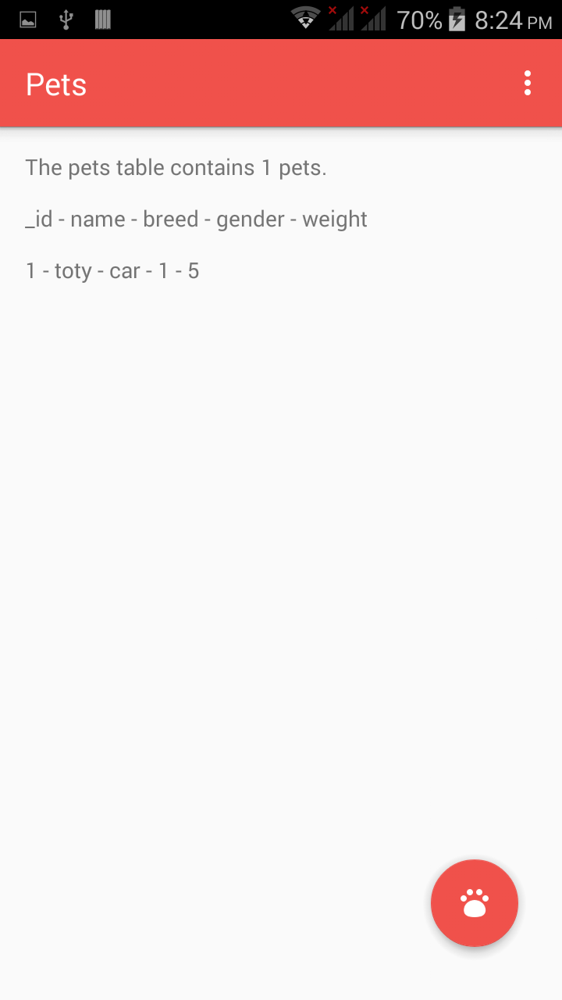

# Pets

An app to save details about any pet in database .

# HOW TO RUN

## when you open the app.

## then you click on Family sector.

## then you click on save.

# Implementation

the code divided to:

1-front end:

multiple xml files to for activity_category , activity_main and list-item.

2-back end:

i used CursorAdapters, Provider, Contract and Activites .
